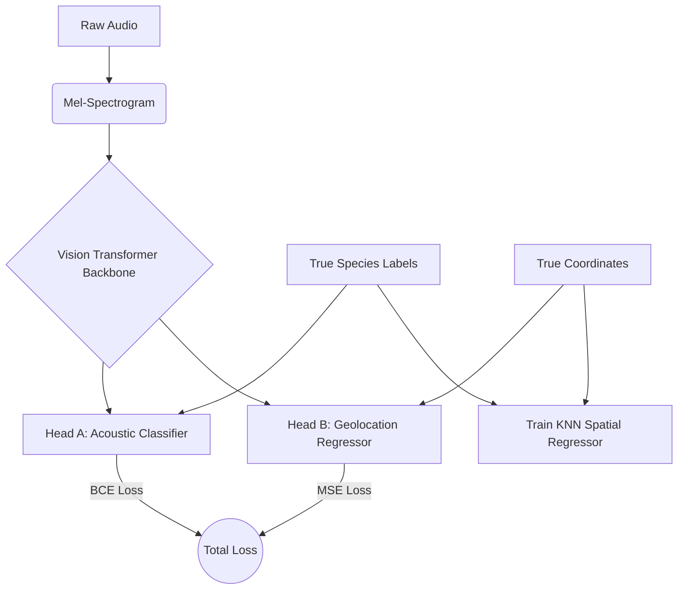
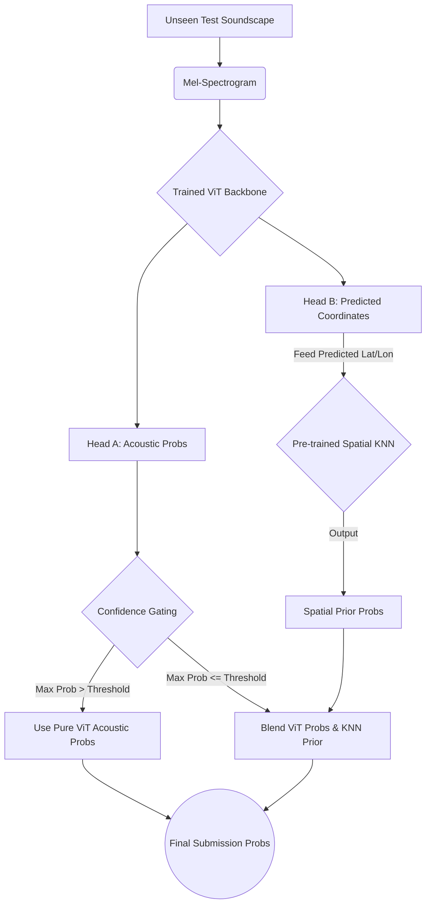

# Pipeline Flow: Alter-Strat-2

This document illustrates the flow of the Geo-Acoustic Self-Distillation pipeline, specifically highlighting the Dual-Head ViT architecture and the Confidence-Based Blending during inference.

## Training Pipeline Flow



## Inference Pipeline Flow (Zero-Leakage Test Set)



## Confidence-Gated Blending Logic (Pseudocode)

```python
# Inference-time blending decision
THRESHOLD = 0.85
ALPHA = 0.3  # Weight of the KNN prior

final_probs = []
for i in range(batch_size):
    vit_prob = vit_acoustic_probs[i]
    if torch.max(vit_prob) > THRESHOLD:
        # The model is highly confident it heard the bird
        final_probs.append(vit_prob)
    else:
        # The model is unsure, so we lean on the environmental prior
        knn_prob = knn_spatial_priors[i]
        blended = (vit_prob * (1.0 - ALPHA)) + (knn_prob * ALPHA)
        final_probs.append(blended)
```
