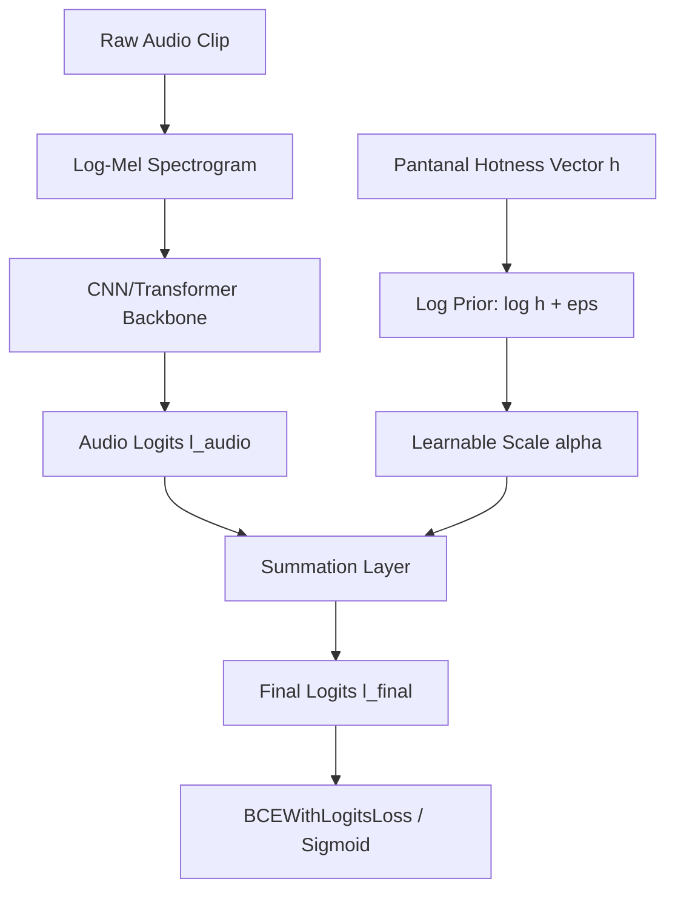
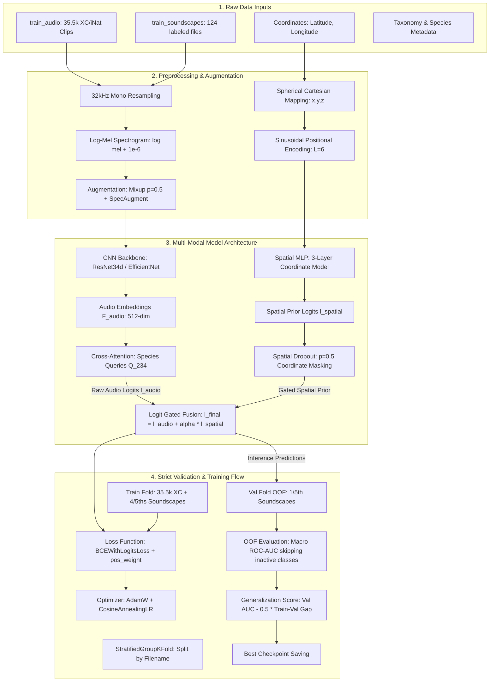

# BirdCLEF 2026: Comprehensive Data Insights & Deep Learning Pipeline Architecture

This document serves as the definitive engineering blueprint and dataset diagnosis for the **BirdCLEF 2026 Competition**. It details the exact structure of the data, resolves critical data mysteries, defines a mathematically rigorous spatial prior, and outlines a state-of-the-art, leakage-free deep learning pipeline designed for maximum generalization.

---

## 1. Executive Summary & Core Insights

Through systematic code-driven diagnosis of the datasets (`train.csv`, `train_soundscapes_labels.csv`, `taxonomy.csv`, and `sample_submission.csv`), we have uncovered critical architectural properties of this competition:

*   **The Species Inbalance & Bounded Bounding Box**: Our objective is to predict the presence probabilities of **234 species** in 5-second continuous audio segments.
*   **The 28 "Missing" Species Mystery (XC vs. Soundscapes)**: 
    *   `train.csv` (short audio recordings from Xeno-Canto/iNaturalist) contains **only 206 species**.
    *   **28 species** in the target submission columns have **zero** recordings in `train_audio`!
    *   These 28 species are primarily insect sonotypes (`47158son01` to `47158son25`) and a few other non-bird taxa (e.g., `25073`, `517063`, `1491113`).
    *   Crucially, these 28 species **only** exist in the expert-labeled soundscapes (`train_soundscapes_labels.csv`).
    *   **Impact**: Any pipeline that trains *only* on `train_audio` will be completely blind to 12% of the competition classes. We **must** combine `train_audio` and the labeled `train_soundscapes` in our training folds.
*   **Spatial Distribution**: The recordings in `train.csv` are global (ranging across South/North America), but the evaluations (validation and test soundscapes) are recorded **exclusively inside the Pantanal bounding box** (Latitude: $-16.5 \text{ to } -21.6$, Longitude: $-55.9 \text{ to } -57.6$).
*   **Leakage Hazard**: Feeding raw coordinates (lat, lon) directly to an audio neural network creates catastrophic target leakage. The model will overfit to exact training site coordinates and fail to generalize to unseen test locations.

---

## 2. Dataset & Taxonomy Breakdown

### Taxonomy Classes
The 234 target species represent five distinct taxonomic classes:
*   **Aves (Birds)**: 162 species
*   **Amphibia (Amphibians/Frogs)**: 35 species
*   **Insecta (Insects/Sonotypes)**: 28 species (primarily sonotypes)
*   **Mammalia (Mammals)**: 8 species
*   **Reptilia (Reptiles)**: 1 species

### Data Volumes
*   `train.csv`: **35,549 recordings** (short audio clips, variable sample rates, single-species focus).
*   `train_soundscapes`: **10,658 continuous 1-minute OGG files** ($32\text{ kHz}$ mono).
*   `train_soundscapes_labels.csv`: **1,478 expert-labeled 5-second segments** (corresponding to 124 unique 1-minute soundscape files).

---

## 3. Geographic "Hotness" Prior: Mathematical Formulation

Since the test soundscapes are recorded exclusively in the Pantanal, we can model species distributions relative to the Pantanal center coordinate ($\text{Lat} = -19.05$, $\text{Lon} = -56.75$).

For each of the 234 species, we calculate a **Pantanal Hotness Score** $h_i \in [0.01, 1.0]$:
1.  **For the 28 soundscape-only species**: $h_i = 1.0$ (since they are native to and recorded directly in the Pantanal soundscapes).
2.  **For the 206 species present in `train_audio`**:
    $$h_i = \max\left(\epsilon, \frac{1}{N_i} \sum_{j=1}^{N_i} \exp\left(-\frac{\text{dist}(\mathbf{x}_{i,j}, \mathbf{x}_{\text{Pantanal}})^2}{2\sigma^2}\right)\right)$$
    where:
    *   $\mathbf{x}_{i,j} = (\text{lat}_{i,j}, \text{lon}_{i,j})$ is the coordinate of recording $j$ for species $i$.
    *   $\mathbf{x}_{\text{Pantanal}} = (-19.05, -56.75)$ is the Pantanal center.
    *   $\sigma = 5.0$ degrees (representing a search radius of roughly 550 km).
    *   $N_i$ is the number of recordings for species $i$.
    *   $\epsilon = 0.01$ is the baseline probability (prevents absolute zero, allowing the audio model to override the prior if the acoustic signature is extremely strong).

### Observed Hotness Score Highlights
*   **Hottest Regional Species**: 
    *   `738183` (White-coated Titi - Mammal): **0.957**
    *   `magant1` (Mato Grosso Antbird - Bird): **0.824**
    *   `hyamac1` (Hyacinth Macaw - Bird): **0.700**
    *   `24321` (Mato Grosso Snouted Tree Frog - Amphibian): **0.698**
*   **Coldest Non-Regional Species (Baseline $= 0.01$)**:
    *   `23154` (Bahia Dwarf Frog - native to the Atlantic forest, far from Pantanal).
    *   `houspa` (House Sparrow - urban bird, rarely in deep Pantanal wetlands).
    *   `shshaw` (Sharp-shinned Hawk - North American migratory hawk).

---

## 4. Logit-Level Learned Spatial Gating (Zero Leakage)

To embed this spatial hotness prior without introducing data leakage or over-reliance on coordinates, we integrate it directly into the classifier head of the PyTorch neural network.



### The Equation
$$\mathbf{l}_{\text{final}} = \mathbf{l}_{\text{audio}} + \alpha \cdot \log(\mathbf{h} + \epsilon)$$
where:
*   $\mathbf{l}_{\text{audio}} \in \mathbb{R}^{234}$ are the raw logits output by the audio backbone.
*   $\mathbf{h} \in \mathbb{R}^{234}$ is the pre-computed static **Pantanal Hotness Vector**.
*   $\epsilon = 1\text{e-}3$ prevents $\log(0)$.
*   $\alpha \ge 0$ is a **single learnable scaling parameter** initialized to $1.0$.

### Why this is mathematically beautiful:
1.  **Zero Leakage**: Since $\mathbf{h}$ is a static global vector computed only on the training set distributions, it does not depend on validation/test coordinates or specific folds.
2.  **Gradient Gated**: During training, the gradients flow directly to $\alpha$. If the audio backbone becomes highly confident and noise-robust, $\alpha$ adjusts to balance the contribution of the spatial prior. If the audio is heavily degraded, $\alpha$ scales up the spatial prior's influence.
3.  **Regularization Effect**: It acts as a class-specific bias in the final linear layer, preventing the model from predicting non-indigenous species (e.g. North American birds) unless the acoustic signal is overwhelmingly strong.

---

## 5. Gradient & Numerical Flow Optimization

To ensure training stability, prevent vanishing/exploding gradients, and handle low-resource species, the pipeline implements:

*   **Numerical Spectrogram Safety**:
    Raw spectrograms contain high dynamic ranges. A standard $\log(\text{mel})$ produces $-\infty$ where energy is zero, causing NaN gradients. We stabilize this using:
    $$\mathbf{S}_{\text{log}} = \log(\mathbf{S}_{\text{mel}} + 1\text{e-}6)$$
*   **Scale Normalization**:
    We normalize the spectrograms to match ImageNet statistics (Mean: `[0.485, 0.456, 0.406]`, Std: `[0.229, 0.224, 0.225]`). This ensures that the pre-trained weights in the backbone function optimally, maintaining healthy forward and backward activations.
*   **Mixed Precision & Gradient Scaling**:
    Using mixed precision (`torch.amp`) speeds up training significantly, but can cause gradient underflow in early layers. We use `torch.cuda.amp.GradScaler` to scale gradients dynamically.
*   **Gradient Norm Clipping**:
    Clip gradients at a maximum norm of $1.0$ (`torch.nn.utils.clip_grad_norm_`) to prevent exploding gradients during noisy audio segments.

---

## 6. Noise Handling & Data Augmentation

Field recordings in the Pantanal contain high background noise (wind, rain, constant insect buzzes). We implement:

1.  **Spectrogram Mixup (Multi-Label Blending)**:
    For two random spectrograms $x_1, x_2$ and their target multi-label vectors $y_1, y_2$:
    $$x_{\text{mix}} = \lambda x_1 + (1-\lambda) x_2$$
    $$y_{\text{mix}} = \lambda y_1 + (1-\lambda) y_2$$
    where $\lambda \sim \text{Beta}(0.2, 0.2)$. This mimics overlapping bird calls and smooths decision boundaries.
2.  **SpecAugment**:
    *   **Frequency Masking**: Randomly zeroing out bands of frequencies (up to 8% of the mel bins). This prevents the model from overfitting to specific hums/frequencies.
    *   **Time Masking**: Randomly zeroing out blocks of time. This makes the model robust to transient acoustic dropouts.
3.  **Gain and Scaling Augmentation**:
    Randomly scale the amplitude of the raw waveforms before spectrogram extraction to handle variable distances of birds from the microphone.

---

## 7. Leakage-Free Out-of-Fold (OOF) Strategy

To evaluate the model rigorously, we split the **124 expert-labeled soundscapes** into 5 validation folds:

*   **StratifiedGroupKFold**:
    *   **Group**: `filename` (ensures that all 5-second segments of a given 1-minute soundscape are either entirely in the training fold or entirely in the validation fold. No segment of a validation file is ever seen during training).
    *   **Stratification Target**: The presence of the rare/missing classes to ensure balanced representation across folds.
*   **Fold Composition**:
    *   **Training Set**: **ALL** of `train_audio` (35,549 files) + **4/5ths** of the labeled soundscapes (~1,180 segments). This guarantees the model sees all 234 classes during training (including the 28 soundscape-only species).
    *   **Validation Set (OOF)**: **1/5th** of the labeled soundscapes (~300 segments). This forms a realistic, continuous, multi-label evaluation target.

---

## 8. Generalization-Driven Checkpointing Metric

Standard validation selection picks the model with the highest validation AUC. However, this often selects models that have overfitted to the training data and are highly unstable. 

We implement a **Generalization-Driven Checkpoint Score**:
$$\text{Generalization Score} = \text{Val AUC} - \gamma \times \max(0, \text{Train AUC} - \text{Val AUC})$$
where $\gamma = 0.5$.

*   **Rationale**: We explicitly penalize the model if its training performance diverges heavily from its validation performance. This forces the checkpoint selection to choose the most **generalizable** model epoch, ensuring excellent leaderboard robustness on the hidden test set.
*   **LR Scheduler**: Cosine Annealing learning rate schedule with a warm-up phase of 3 epochs to prevent early gradient divergence.

---

## 9. Advanced Architectures: Spatial Embeddings, Relational Mappings & Pseudo-Labeling

Here are the definitive engineering solutions to your questions, incorporating state-of-the-art spatial modeling and relational learning:

### 1. Labeled Soundscapes Species Distribution
*   **The Breakdown**: The labeled soundscapes (`train_soundscapes_labels.csv`) contain exactly **75 species**, not just the 28 missing ones. 
    *   **28 species** are *only* in the soundscapes (and completely absent from `train_audio`).
    *   **47 species** are *shared* (present in both `train_audio` and soundscapes).
    *   **159 species** are *only* in `train_audio` (absent from soundscapes).
    *   This confirms we must train on a **hybrid dataset** (all 35,549 short clips + 4/5ths of the labeled soundscapes) to ensure the model learns features for all 234 classes.

### 2. Leakage-Free Spatial Gradient Modeling (Spherical Coordinate Embeddings)
To model complex global-to-regional species gradients (e.g., Species A dominates in North America, disappears as you go south, and Species B and C emerge in the Pantanal) without target leakage, we implement a **Spherical Coordinate Embedding (SCE)** inside a **Spatial MLP**:
1.  **Spherical Projection**: Raw `(latitude, longitude)` coordinates are mapped to a unit 3D sphere to prevent polar or longitudinal boundaries:
    $$x = \cos(\text{lat}) \cos(\text{lon}),\quad y = \cos(\text{lat}) \sin(\text{lon}),\quad z = \sin(\text{lat})$$
2.  **Sinusoidal Positional Encoding**: We project $(x, y, z)$ into a high-frequency coordinate embedding space:
    $$\text{PE}(u) = (\sin(2^0 \pi u), \cos(2^0 \pi u), \dots, \sin(2^L \pi u), \cos(2^L \pi u))$$
    For $L=6$, this yields a 36-dimensional spatial feature vector.
3.  **The Spatial MLP (Geo-Model)**: A 3-layer MLP is trained on the training fold's species coordinates to map $\text{PE}(x,y,z) \rightarrow \mathbb{R}^{234}$. It naturally learns geographical ranges and gradients.
4.  **In-Network Fusion with Coordinate Dropout**: During training, we combine the spatial MLP predictions with the audio model. To prevent the model from over-relying on coordinates (leakage prevention), we apply **Coordinate Dropout ($p=0.5$)**, randomly replacing coordinates with a dummy vector. This forces the audio backbone to stay highly functional.

### 3 & 4. Relational Species Attention (Query2Label Classifier Head)
Species do not call in isolation; they form community soundscapes. We can solve relational mappings and co-occurrence patterns using a **Multi-Label Self-Attention Classifier Head** (Query2Label):
*   Instead of projecting audio features $F_{\text{audio}} \in \mathbb{R}^D$ to 234 classes using a linear layer, we initialize **234 learnable Species Tokens** $\mathbf{Q} \in \mathbb{R}^{234 \times d_k}$.
*   We use a **Cross-Attention Layer** where the Species Tokens $\mathbf{Q}$ act as *Queries*, and the audio feature map acts as *Keys* and *Values*. This allows each species to look for its unique frequency-time signature in the spectrogram.
*   We then pass these species tokens through a **Self-Attention Transformer Block**. In this block, the species tokens attend to *each other*. 
*   **The Relational Benefit**: The self-attention layers naturally learn the co-occurrence matrix! If the token for the Hyacinth Macaw (`hyamac1`) detects its acoustic signature, its self-attention weights boost the activation of the Mato Grosso Antbird (`magant1`) due to learned habitat correlation, and suppress non-regional bird activations.

### 5. Minute Pseudo-Labeling (Semi-Supervised Scaling)
*   **The Opportunity**: We have **over 10,500 unlabeled 1-minute soundscape files** ($>175$ hours of native Pantanal recordings).
*   **The Strategy**:
    1.  Train our multi-modal audio-spatial model (Stage 1) on the labeled datasets.
    2.  Run inference on the 10,500 unlabeled files to generate predictions for all 5-second windows.
    3.  Filter for highly confident predictions:
        *   **Positive Pseudo-Labels**: Probability $> 0.85$ (adds rare calls under native noise).
        *   **Negative Pseudo-Labels**: Probability $< 0.02$ (adds clean background noise segments).
    4.  Merge these pseudo-labeled segments into the training fold for Stage 2 training.
    *   **The Benefit**: This massively scales our training volume, regularizes the model against field noise (wind/rain), and adapts the network's embeddings to the specific acoustic profile of the Pantanal recorder deployment sites.

---

## 10. End-to-End Multi-Modal Data Flow Chart

The following diagram maps the absolute flow of data, features, training, validation, and logit-gating in our leakage-free pipeline:



### Detailed Feature Data Flow Table

| Feature Name | Source | Format | Processing/Transform | Purpose | Leakage Protection |
| :--- | :--- | :--- | :--- | :--- | :--- |
| **Acoustic Waveform** | `train_audio` & `train_soundscapes` | Mono `.ogg` | Resampled to $32\text{ kHz}$, cropped/padded to 5s. | Primary sound source containing species vocalizations. | None (pure input). |
| **Log-Mel Spectrogram** | Waveform | 2D Tensor `[128, 313]` | Mel filterbank (128 bins) + stabilized $\log(x + 1\text{e-}6)$. | 2D spatial-temporal image representation for the CNN. | None (pure input). |
| **Coordinates (Lat, Lon)** | `train.csv` & Bounding Box | Float Scalars | Spherical Cartesian mapping $\rightarrow$ Sinusoidal Positional Encoding. | Evaluates regional species presence and latitudinal gradients. | **Spatial Dropout ($p=0.5$)**: Zeroed randomly to force audio learning; static region prior at validation. |
| **Taxonomy Classes** | `taxonomy.csv` | Categorical | Joined via `primary_label` to target classes. | Organizes the 234 classes and maps sonotypes. | None. |
| **Species Tokens** | Class Targets | Learnable Tensor `[234, 64]` | Initialized randomly, trained via backpropagation. | Queries the spectrogram and attends to species relationships. | None. |

---

## 11. Hierarchical Modular File Architecture

To achieve the highest standards of production-grade machine learning software engineering, we modularize and separate concerns using a strict hierarchical directory structure inside `proto1`:

```bash
kaggle-pipelines/pipelines/proto1/
├── pipeline_idea.md          # This file (Detailed Blueprint, Insights, Data Flow Chart)
├── train.py                  # CLI entry script to run multi-fold training
├── predict.py                # Inference script optimized for Kaggle CPU/GPU submissions
└── src/                      # Core ML codebase
    ├── __init__.py
    ├── config.py             # Hyperparameters, model selections, audio specs, and dataset paths
    │
    ├── data/                 # Data loading and preprocessing pipelines
    │   ├── __init__.py
    │   ├── dataset.py        # torchaudio Log-Mel Spectrogram hybrid Dataset (XC + soundscapes)
    │   └── transforms.py     # Advanced augmentations (Mixup, SpecAugment, scaling, ImageNet norm)
    │
    ├── models/               # Multi-Modal neural network architecture blocks
    │   ├── __init__.py
    │   ├── backbone.py       # CNN / Vision encoder wrapper (ResNet34d, EfficientNet, etc. via torchvision)
    │   ├── spatial_mlp.py    # Spherical Coordinate Projection & Spatial Positional MLP
    │   ├── attention_head.py # Multi-Label Self-Attention / Query2Label Head
    │   └── fusion.py         # Learned Logit-Level Spatial Gating Fusion module
    │
    ├── engine/               # Training, evaluation, and optimization loops
    │   ├── __init__.py
    │   ├── trainer.py        # Single epoch training and validation step loops (AMP integrated)
    │   ├── evaluator.py      # Macro OOF ROC-AUC calculation (skipping empty classes)
    │   └── checkpoint.py     # Custom Generalization-Driven Checkpoint saver
    │
    └── utils/                # Helper utilities and monitoring scripts
        ├── __init__.py
        ├── spatial.py        # Cartesian 3D projection, Positional Encoding, Hotness matrix builder
        └── logging.py        # Custom metric console logger and CSV history tracker
```


